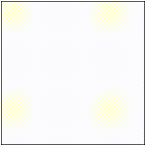

# handwriting-canvas

JavaScript library for handwriting on canvas



## Motivation

Sometimes it is nice to "handwrite" easily on a web browser. For example, when you want to create a simple application using MNIST.

In such cases, this library provides "handwriting" in a simple setting.

## Requirements

Because this library uses canvas, it is assumed to work in the browser.

## Installation

You can install with CDN like bellow.

```html
<script src="https://cdn.jsdelivr.net/npm/handwriting-canvas/dist/main.min.js"></script>
```

You can also install with npm.

```console
npm install handwriting-canvas
```

## Usage

Please see the examples directory [here](./examples/)!

## Licence

MIT
